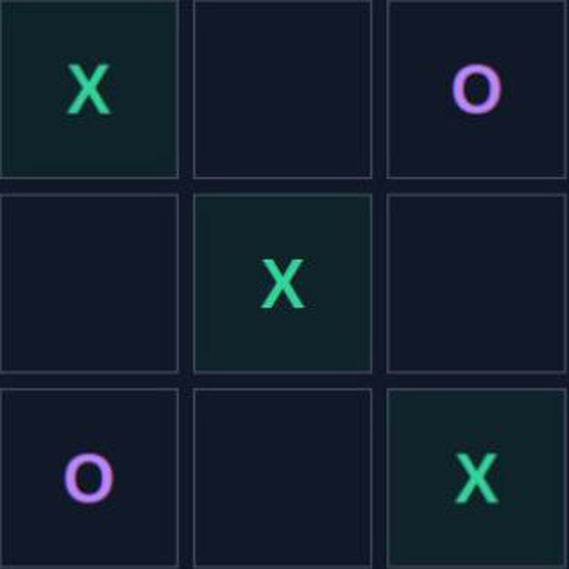
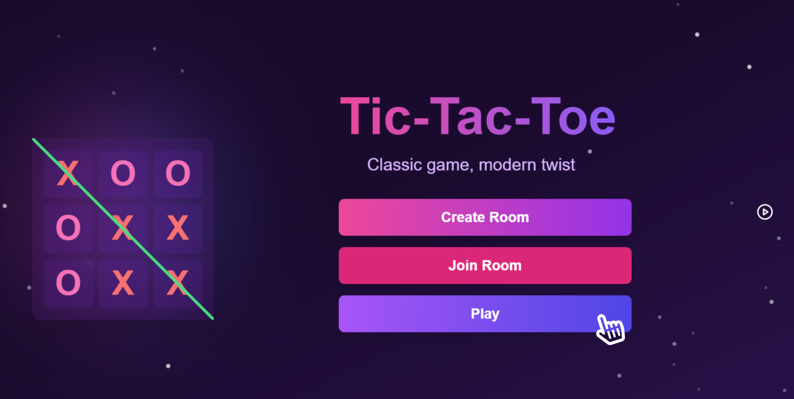
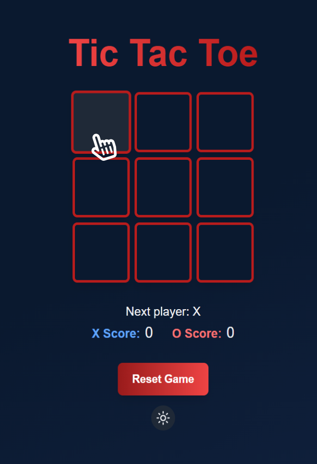
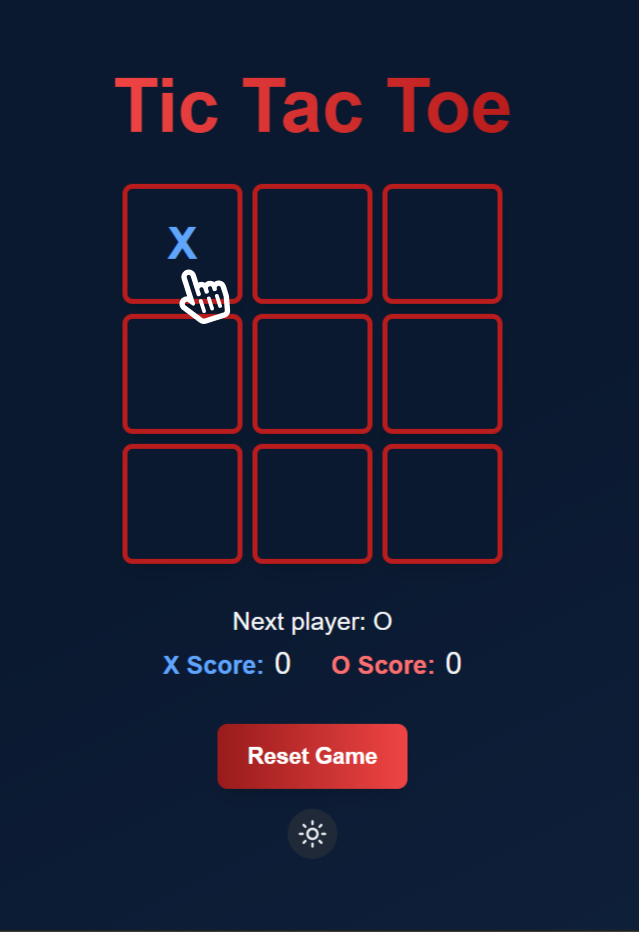
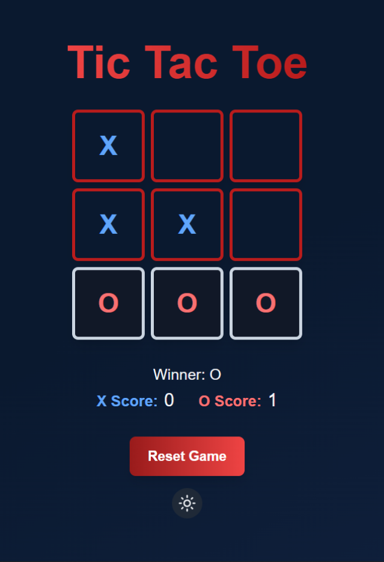
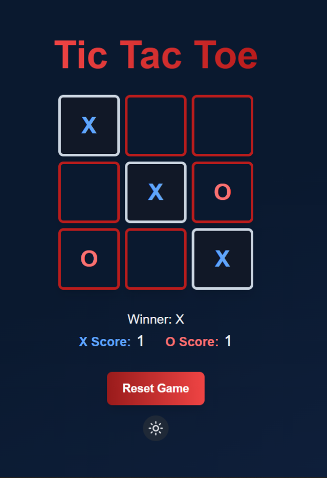
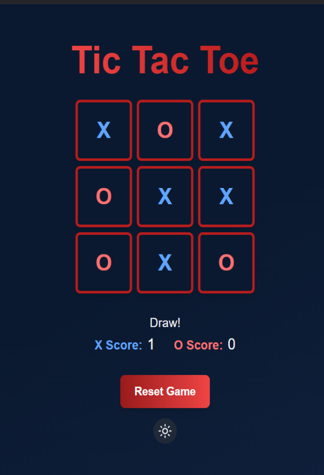
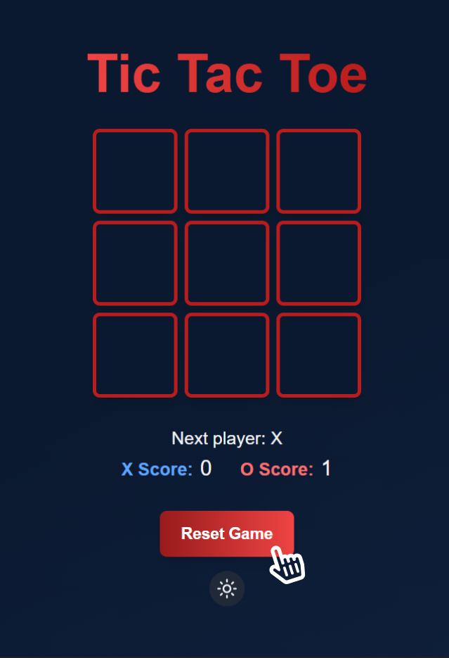

<h1 align="center">  Onchain TicTacToe game </h1>

  

  
  

  

## Overview

A fully onchain Tic-Tac-Toe game built on Starknet using the Dojo engine. This project demonstrates the power of onchain gaming using Cairo and provides a seamless, provable gaming experience on Starknet.

## Features

- 🎮 **Onchain Gaming**: Fully onchain game logic using Dojo engine
- 🖥️ **Cairo Language**: Written in Cairo for Starknet deployment
- ⚛️ **React Frontend**: Modern React-based UI for playing the game

 

## Contributors

 

## Resources

###  [Contributor's guide](./CONTRIBUTING.md) >

### [Setting up the Project](./SETUP.md) >

 

## How To Play

1. **Getting Started**
   - Visit the game website
   - Click "Play" to begin
   

2. **Start**
   - Players take turns clicking on empty squares to place their symbol
   

3. **Making Moves**
   - 'X' goes first, followed by 'O'
   - Player 1 plays as 'X' and Player 2 plays as 'O'
   

4. **Winning the Game**
   - Get three of your symbols in a row (horizontally, vertically, or diagonally) to win
   - The game will highlight the winning combination
   
   

5. **Draw**
   - If all squares are filled without a winning combination, the game ends in a draw
   

6. **Reset Game**
  To start another round, click "Reset Game"
   

